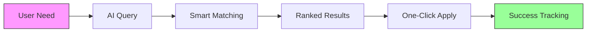

# Visualization Strategies for Rome URC
## Civil Society Grants Database

---

## 1. 📊 Core Impact Visualizations

### Growth Trajectory Animation
```
Week 1: 98 grants  ━━━━━━━━━━
Week 2: 117 grants ━━━━━━━━━━━━━━━━
Week 3: 136 grants ━━━━━━━━━━━━━━━━━━━━━━
Year 1: 1000+ grants ━━━━━━━━━━━━━━━━━━━━━━━━━━━━━━━━━━━━━━━━━━━━━━━━
```

### Funding Mobilization Flow
```
€63M ──┐
       ├──► €75M (Current)
€12M ──┘         └──► €300M+ (Projected)
```

### User Impact Multiplication
```
Current:     •••••                    (500 users/month)
With IRF:    •••••••••••••••••••••• (10,000+ users/month)
```

---

## 2. 🔄 Before/After Comparison

### Feature Evolution Matrix

| Feature | Current | Next Level | Visual |
|---------|---------|------------|--------|
| Updates | ⏱️ Weekly Manual | ⚡ Real-time Auto | 168x faster |
| Languages | 🌍 3 | 🌐 8+ | 2.7x reach |
| AI Power | 🤖 Basic | 🧠 Advanced | 5x smarter |
| Coverage | 🇺🇦 Ukraine | 🌍 CEE Region | 7x area |

---

## 3. 🎯 Live Demo Flow



---

## 4. 💰 ROI Dashboard

### Investment Impact Visualizer

```
€1 Invested
    ├─► €300+ Grants Accessed
    ├─► 40+ NGOs Helped  
    ├─► 400+ Hours Saved
    └─► 1 Region Transformed
```

### Funding Flow Projection
```
         Month 1-3      Month 4-6      Month 7-9      Month 10-12
Grants:    200 ━━━━━━► 500 ━━━━━━━► 750 ━━━━━━━━► 1000+
Users:     1K  ━━━━━━► 3K  ━━━━━━━━► 6K  ━━━━━━━━► 10K+
Countries: 1   ━━━━━━► 2   ━━━━━━━━► 4   ━━━━━━━━► 5+
```

---

## 5. 🗺️ Geographic Expansion Map

### Phase 1: Ukraine (Current)
```
    ┌─────────┐
    │   🇺🇦    │ 136 grants
    │ UKRAINE │ 2,400 users
    └─────────┘
```

### Phase 2: Regional Expansion (Month 6-9)
```
┌─────────┐ ┌─────────┐ ┌─────────┐
│   🇲🇩    │ │   🇬🇪    │ │   🇦🇲    │
│ MOLDOVA │ │ GEORGIA │ │ ARMENIA │
└─────────┘ └─────────┘ └─────────┘
     ↓           ↓           ↓
  200 grants  150 grants  100 grants
  2K users    1.5K users  1K users
```

### Phase 3: Full CEE Coverage (Month 12)
```
    🇵🇱 🇨🇿 🇸🇰
     ↓   ↓   ↓
┌───────────────┐
│  CEE REGION   │ 1000+ grants
│  5+ Countries │ 10,000+ users
└───────────────┘
```

---

## 6. 📱 User Journey Transformation

### Current Journey (Pain Points)
```
😓 Need Grant ──10hrs──> 🔍 Manual Search ──5hrs──> 📝 Application ──?──> ❓ Unknown Result
```

### Next Level Journey (Seamless)
```
😊 Need Grant ──30min──> 🤖 AI Match ──1hr──> 📝 Guided Application ──tracked──> ✅ Success!
```

---

## 7. 🏆 Success Metrics Dashboard

### Real-Time Conference Display
```
┌─────────────────────────────────────┐
│  LIVE IMPACT COUNTER                │
│                                     │
│  Grants Found Today:    ▓▓▓▓ 47    │
│  Hours Saved:          ▓▓▓▓▓ 470   │
│  Active Users Now:      ▓▓▓ 234    │
│  Success Stories:         ▓▓ 12     │
└─────────────────────────────────────┘
```

---

## 8. 🎨 Visual Design Guidelines

### Color Palette
- **Primary Blue**: #0066CC (Trust, Stability)
- **Success Green**: #00AA44 (Growth, Achievement)  
- **Alert Orange**: #FF6600 (Opportunity, Urgency)
- **Tech Purple**: #6633CC (Innovation, AI)

### Typography
- **Headlines**: Bold, Sans-serif (Impact)
- **Body**: Clean, Readable (Clarity)
- **Data**: Monospace (Precision)

### Icons & Graphics
- Use universally recognized symbols
- Ensure accessibility (alt text)
- Optimize for projection/print
- Mobile-friendly sizing

---

## 9. 📹 Video/Animation Concepts

### 30-Second Impact Video
1. Problem statement (5s)
2. Platform demo (10s)
3. Success metrics (10s)
4. Call to action (5s)

### Interactive Demos
- Live grant search
- Real-time translation
- Mobile experience
- AI recommendations

---

## 10. 🎪 Booth Display Architecture

### Physical Layout
```
┌─────────────────────────────────┐
│     LARGE SCREEN (Live Demo)    │
├─────────┬─────────┬─────────────┤
│ Success │ tablets │   Meeting   │
│ Stories │  Demo   │    Area     │
│  Wall   │ Station │             │
└─────────┴─────────┴─────────────┘
```

### Digital Displays
1. **Main Screen**: Platform demo loop (3 min)
2. **Stats Screen**: Real-time metrics
3. **Story Screen**: Rotating testimonials
4. **Map Screen**: Expansion visualization

---

## Key Takeaway Visuals

1. **One Number**: €300 return per €1 invested
2. **One Image**: Map showing 5-country expansion
3. **One Story**: NGO finding perfect grant in 30 minutes
4. **One Demo**: AI answering in Ukrainian

These visualizations tell the story of transformation - from local tool to regional infrastructure, from manual searches to AI-powered discovery, from 500 to 10,000+ organizations served.